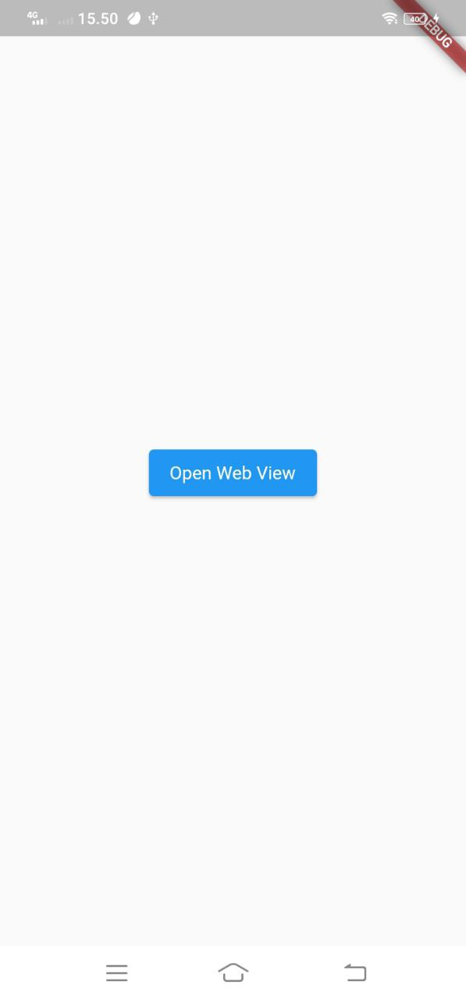
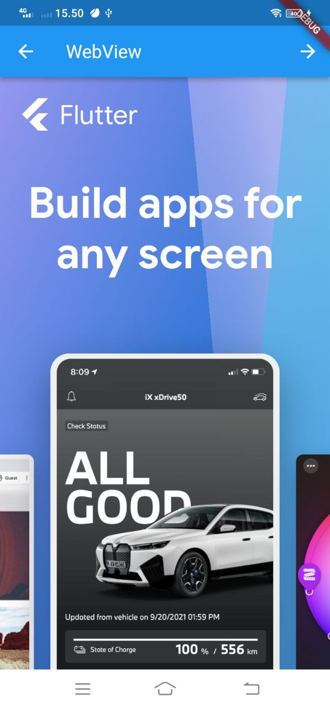
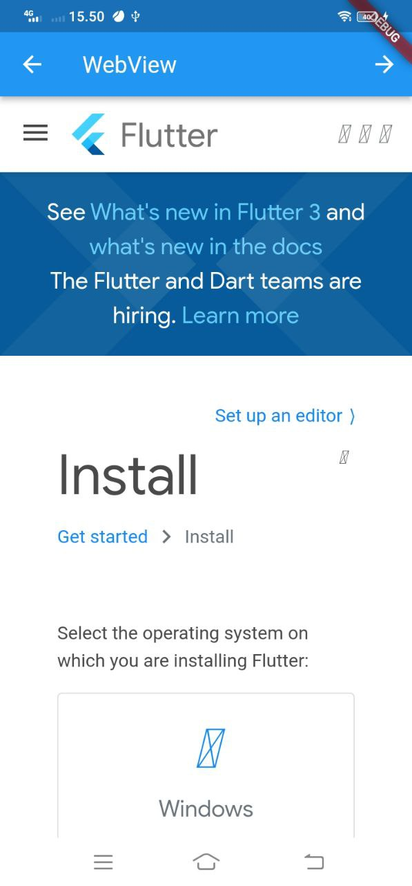

# Inroduction to webview

WebView for Flutter
A Flutter plugin that provides a WebView widget.

On iOS the WebView widget is backed by a WKWebView; On Android the WebView widget is backed by a WebView.[Official Documantation](https://pub.dev/packages/webview_flutter)

# Usage

Add webview_flutter as a dependency in your pubspec.yaml file. If you are targeting Android, make sure to read the Android Platform Views section below to choose the platform view mode that best suits your needs.

You can now include a WebView widget in your widget tree. See the WebView widget's Dartdoc for more details on how to use the widget.

# Android Platform Views

This plugin uses Platform Views to embed the Android’s webview within the Flutter app. It supports two modes: hybrid composition (the current default) and virtual display.

Here are some points to consider when choosing between the two:

- Hybrid composition has built-in keyboard support while virtual display has multiple keyboard issues.
- Hybrid composition requires Android SDK 19+ while virtual display requires Android SDK 20+.
- Hybrid composition and virtual display have different performance tradeoffs.

# Using Hybrid Composition

The mode is currently enabled by default. You should however make sure to set the correct minSdkVersion in android/app/build.gradle if it was previously lower than 19:

```ts
android {
    defaultConfig {
        minSdkVersion 19
    }
}
```

# Using Virtual displays

- 1. Set the correct minSdkVersion in android/app/build.gradle (if it was previously lower than 20)

```ts
android {
     defaultConfig {
         minSdkVersion 20
     }
 }
```

- 2. Set WebView.platform = AndroidWebView(); in initState(). For example:

```ts
import 'dart:io';

 import 'package:webview_flutter/webview_flutter.dart';

 class WebViewExample extends StatefulWidget {
   @override
   WebViewExampleState createState() => WebViewExampleState();
 }

 class WebViewExampleState extends State<WebViewExample> {
   @override
   void initState() {
     super.initState();
     // Enable virtual display.
     if (Platform.isAndroid) WebView.platform = AndroidWebView();
   }

   @override
   Widget build(BuildContext context) {
     return WebView(
       initialUrl: 'https://flutter.dev',
     );
   }
 }

```

# Main Pge

```ts
return MaterialApp(
      title: 'Flutter Demo',
      theme: ThemeData(
        primarySwatch: Colors.blue,
      ),
      home: HomePage(),
```

<h2>Controller</h2>

```ts
late WebViewController webViewController;

```

<h2>actions</h2>

```ts
          actions: [
            IconButton(
              icon: const Icon(Icons.arrow_forward),
              onPressed: () async {
                if (await webViewController.canGoForward()) {
                  await webViewController.goForward();
                }
              },
          ],
```

<h2>leading</h2>

```ts

 leading: IconButton(
            icon: const Icon(Icons.arrow_back),
            onPressed: () async {
              if (await webViewController.canGoBack()) {
                await webViewController.goBack();
              } else {
                Navigator.of(context).pop();
              }
            },
          ),

```

<h2>Webview controller</h2>

```ts

 body: WebView(
          onWebViewCreated: (controller) {
            webViewController = controller;
          },
          initialUrl: 'https://flutter.dev',

```

<h2>Home Page</h2>

```ts
body: Center(
        child: ElevatedButton(
          child: const Text("Open Web View"),
          onPressed: () {
            Navigator.of(context).push(
              MaterialPageRoute(
                builder: ((context) => const WebviewPage()),
              ),
            );
          },
        ),

```

# Screenshots Result

  
